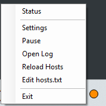
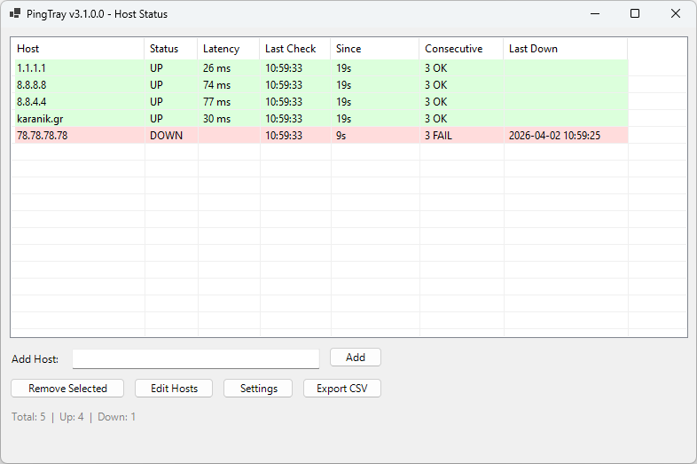
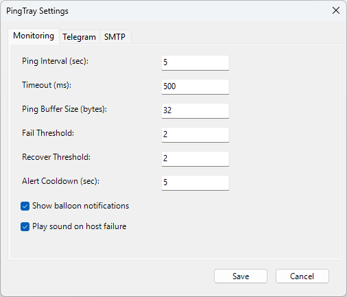
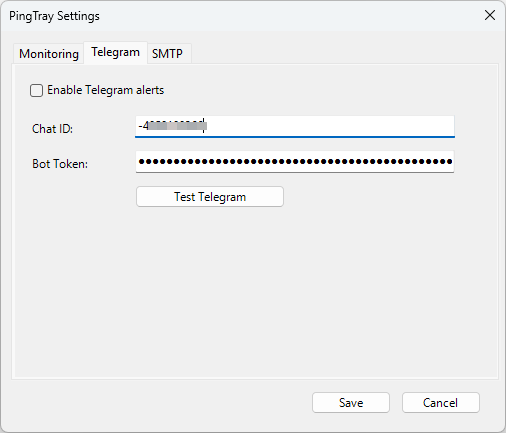
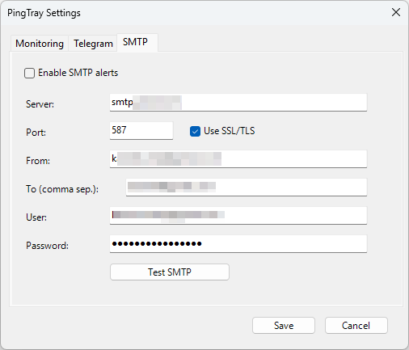

# PingTray

[](https://github.com/karanikn/PingTray)
[](https://github.com/PowerShell/PowerShell)
[](https://www.microsoft.com/windows)
[](https://github.com/karanikn/PingTray/blob/main/LICENSE)
[](https://claude.ai)

> **A lightweight Windows system tray tool that pings multiple hosts and alerts you when they go down — via color-coded tray icon, balloon notifications, Telegram, and SMTP email.**  
> Single-file PowerShell script — no installation required.

---

## 📸 Screenshots

| Status Window | Tray Menu |
|---|---|
|  |  |

| Monitoring Settings | Telegram Settings | SMTP Settings |
|---|---|---|
|  |  |  |

---

## ✨ Overview

**PingTray** sits quietly in your Windows system tray and continuously pings a configurable list of hosts. When a host goes down (or recovers), you get instant feedback through:

- **Tray icon color** — Green (all up), Orange (partial), Red (all down)
- **Status dashboard** — real-time window with latency, color-coded rows, elapsed time, last down timestamp, and counters
- **Windows balloon notifications** — toast alerts on state changes
- **Alert sound** — optional system sound on host failure
- **Telegram messages** — via Bot API (optional)
- **SMTP email alerts** — to one or more recipients (optional)

All monitoring parameters are configurable from the GUI. Host management (add/remove) can be done from the Status window or by editing `hosts.txt`. All alert credentials are stored **encrypted per-user** using Windows DPAPI.

---

## 🚀 Quick Start

```powershell
powershell.exe -NoLogo -NoProfile -ExecutionPolicy Bypass -File ".\PingTray.ps1"
```

Hidden window (recommended):

```powershell
powershell.exe -NoLogo -NoProfile -WindowStyle Hidden -ExecutionPolicy Bypass -File ".\PingTray.ps1"
```

### Auto-start with Windows

Place a shortcut in your Startup folder: `shell:startup`

---

## 📋 Requirements

| Requirement | Details |
|-------------|---------|
| OS | Windows 10 / 11 / Server 2016+ |
| PowerShell | 5.1 or later |
| .NET Framework | 4.5+ (included in Windows 10+) |
| Permissions | No admin rights required |

---

## 🖥️ System Tray Interface

Right-click the tray icon to access:

| Menu Item | Description |
|-----------|-------------|
| **Status** | Opens the Status dashboard window |
| **Settings** | Opens the Settings dialog (Monitoring / Telegram / SMTP) |
| **Pause / Resume** | Temporarily stops or resumes monitoring |
| **Open Log** | Opens `PingTray.log` in the default text editor |
| **Reload Hosts** | Re-reads `hosts.txt` without restarting |
| **Edit hosts.txt** | Opens `hosts.txt` in Notepad for editing |
| **Exit** | Stops monitoring and removes the tray icon |

**Double-click** the tray icon to open the Status dashboard.

### Tray Icon Colors

| Color | Meaning |
|-------|---------|
| 🟢 Green | All hosts are responding |
| 🟠 Orange | Some hosts are down |
| 🔴 Red | All hosts are down |

---

## 📊 Status Dashboard

The Status window shows a real-time table with the following columns:

| Column | Description |
|--------|-------------|
| **Host** | Hostname or IP address |
| **Status** | `UP`, `DOWN`, or `...` (pending first check) |
| **Latency** | Round-trip time in milliseconds |
| **Last Check** | Time of the most recent ping |
| **Since** | Elapsed time since last state change |
| **Consecutive** | Current consecutive count (e.g., `45 OK` or `3 FAIL`) |
| **Last Down** | Timestamp of the most recent DOWN event for this host |

Rows are color-coded: green for UP, red for DOWN, grey for pending. The dashboard auto-refreshes every ping cycle.

### Buttons

- **Add Host** — type a hostname or IP and click Add (or press Enter); duplicates are detected
- **Remove Selected** — multi-select (Ctrl+Click / Shift+Click) and remove with confirmation
- **Edit Hosts** — opens `hosts.txt` in Notepad for bulk editing; auto-reloads on close
- **Settings** — opens the Settings dialog
- **Export CSV** — exports the current status table to a CSV file via Save dialog

---

## ⚙️ Configuration

### Settings Dialog

Access via tray menu → **Settings** or the Settings button in the Status window.

#### Monitoring Tab

| Setting | Default | Description |
|---------|---------|-------------|
| Ping Interval (sec) | `5` | Seconds between ping cycles |
| Timeout (ms) | `1000` | Ping timeout per host |
| Ping Buffer Size (bytes) | `32` | ICMP payload size |
| Fail Threshold | `2` | Consecutive failures before marking DOWN |
| Recover Threshold | `2` | Consecutive successes before marking UP |
| Alert Cooldown (sec) | `60` | Minimum seconds between external alerts per host |
| Show balloon notifications | `ON` | Toggle Windows toast notifications |
| Play sound on host failure | `OFF` | Play system Exclamation sound when a host goes DOWN |

All monitoring settings are saved to `PingTray.config.json` and take effect immediately (including the ping interval).

#### Telegram Tab

| Field | Description |
|-------|-------------|
| Enable | Toggle Telegram alerts on/off |
| Chat ID | Your Telegram chat or group ID |
| Bot Token | Your Telegram bot token (masked, DPAPI encrypted) |
| Test Telegram | Sends a test message |

#### SMTP Tab

| Field | Description |
|-------|-------------|
| Enable | Toggle SMTP alerts on/off |
| Server | SMTP server hostname |
| Port | SMTP port (default: `587`) |
| Use SSL/TLS | Enable encrypted connection |
| From / To | Sender and recipient(s) |
| User / Password | SMTP authentication (password DPAPI encrypted) |
| Test SMTP | Sends a test email |

### Hosts File (`hosts.txt`)

One hostname or IP per line. Lines starting with `#` are comments. Can be edited via GUI or text editor.

---

## 🗂️ File Structure

```
PingTray/
├── PingTray.ps1             ← PowerShell source
├── Build-PingTray.ps1       ← Build helper (ps2exe)
├── ping.ico                 ← Application icon
├── hosts.txt                ← Host list (editable via GUI)
├── PingTray.log             ← Runtime log (auto-rotated at 5 MB)
├── PingTray.config.json     ← Settings & encrypted credentials
├── Screenshots/
│   ├── PingTray.png
│   ├── PingTrayMonitor.png
│   ├── PingTrayMonitoring.png
│   ├── PingTrayTelegram.png
│   └── PingTraySMTP.png
├── LICENSE
└── README.md
```

---

## 🔐 Security Notes

- **DPAPI encryption** for Telegram bot token and SMTP password — bound to current Windows user
- **Read-only monitoring** — only sends ICMP echo requests
- **No admin required** — runs in user context

---

## 📝 Changelog

### v3.1 — April 2026

- **Monitoring tab in Settings** — new first tab with GUI controls for: ping interval, timeout, buffer size, fail/recover thresholds, alert cooldown, show notifications toggle, and sound on failure toggle; all values saved to config and applied immediately (including live timer interval update)
- **Latency column** — Status dashboard now shows round-trip time in milliseconds; `Test-Host` rewritten to return both success/fail and `RoundtripMs` using `.NET Ping.Send()` with configurable buffer
- **Last Down column** — shows the timestamp of the most recent DOWN event per host, persisted across state changes (visible even after recovery)
- **Sound on failure** — optional system Exclamation sound when a host transitions to DOWN; configurable via checkbox in Monitoring tab
- **Export CSV** — new button in Status window; exports current status table (host, status, latency, fail/ok counts, last change, last down) to CSV via Save dialog
- **Monitoring config persistence** — `Apply-MonitoringConfig` function reads saved Monitoring section from config.json on startup and after Settings save
- **Ping buffer size** — configurable ICMP payload size (default 32 bytes); useful for testing with larger packets

### v3.0 — March 2026

- **Status dashboard window** — resizable WinForms window with ListView table, color-coded rows, auto-refresh
- **Add host from GUI** — text field + Add button with Enter key support and duplicate detection
- **Multi-select Remove** — Ctrl/Shift+Click selection with confirmation dialog
- **Edit Hosts button** — opens Notepad with `-Wait`, auto-reloads on close
- **Settings button** — opens Settings dialog from Status window
- **PS 5.1 variable scoping fix** — all Status controls promoted to `$Script:` scope; refresh moved to named function

### v2.6 — January 2026

- **Bug fix — double-counting `$downCount`** on UP→DOWN transitions
- **Bug fix — PS 5.1 if-expression assignments** replaced with safe pattern
- **Bug fix — timer not stopped on exit**
- **SMTP timeout** (10s default), **alert cooldown** (60s), **log rotation** (5 MB)
- **Version variable** in tray tooltip

### v2.5 — June 2025

- **Settings dialog** with Telegram & SMTP tabs, Test buttons, DPAPI encrypted credentials
- **GDI handle leak fix** — cached icons with `DestroyIcon()` cleanup

### v2.0 — May 2025

- PS 5.1 / ps2exe compatibility, `.NET Ping`, safe BaseDir detection, STA relaunch

### v1.5 — May 2025

- Removed sound notifications (simplified per user request)

### v1.0 — May 2025

- Initial release: tray icon with color status, multi-host ping, balloon notifications, context menu, hosts.txt, logging

---

## 🐛 Known Issues & Limitations

- **Pings are sequential** — with many hosts and high timeouts, a cycle can exceed the configured interval
- **UI thread blocking** — Telegram/SMTP calls run on the UI thread (limited by timeouts)
- **DPAPI portability** — encrypted credentials are tied to current Windows user/machine
- **FileSystemWatcher** not implemented — after editing `hosts.txt` externally, use Reload Hosts

---

## 👤 Author

**Nikolaos Karanikolas** — [karanik.gr](https://karanik.gr)

---

## 🤖 AI Assistance

Built with **[ChatGPT](https://chatgpt.com)** (OpenAI) and **[Claude](https://claude.ai)** (Anthropic).

---

## ⚠️ Disclaimer

This tool performs read-only ICMP ping operations. No changes are made to network configurations or remote hosts. The author takes no responsibility for any issues resulting from use of this tool.
